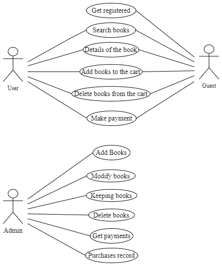
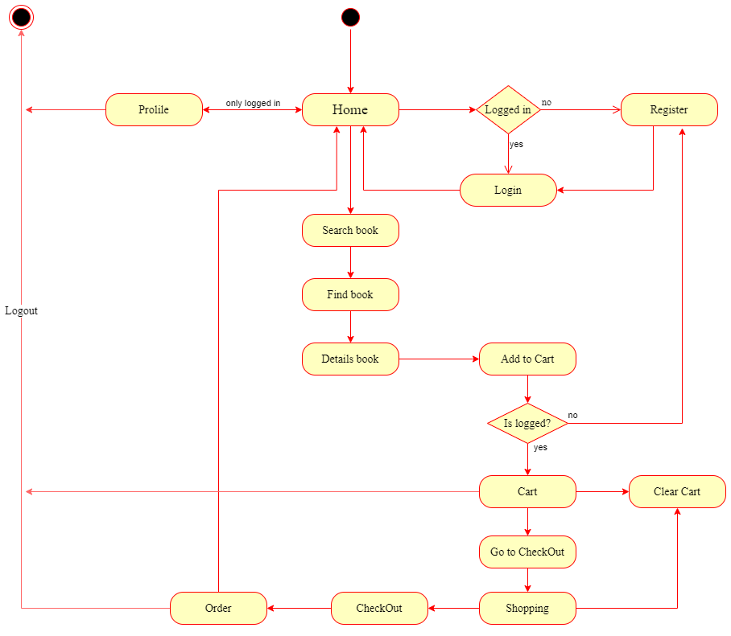
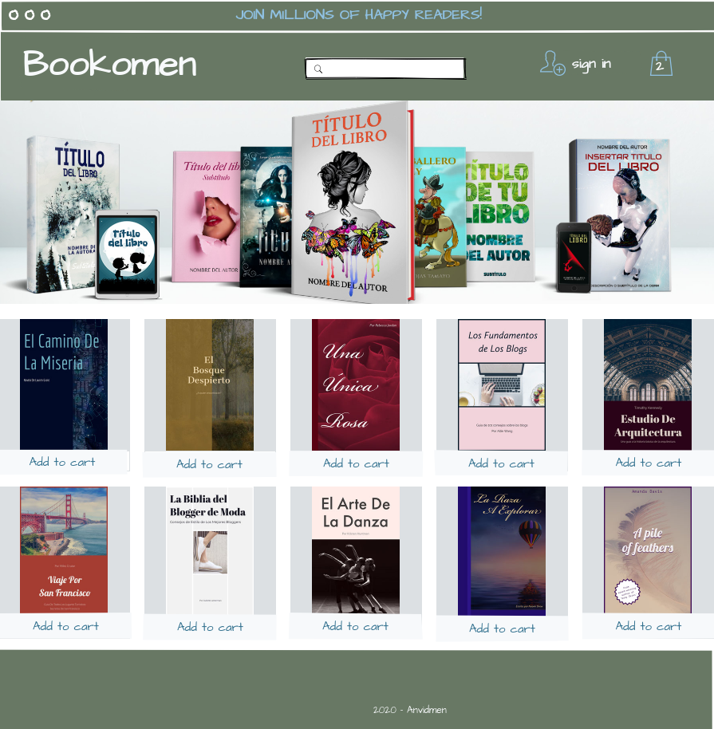

# Bookomen

## Description

**Bookomen** is a website to search, view and buy books in general, either by author or by category.

## Functional description

The e-commerce books **bookomen** will have three roles: user, administrator and guest.

- Guest and user can:

  - Registration and login.
  - Access the details of the book (description, title, author and price).
  - Buy books.

- Admin will have access to all the functions of the website:
  - Add new books for sale.
  - Remove or modify the information regarding a book.
  - Keep record of purchases made by users.
  - Payment and finance management.

## Use cases

## Flowchart

## Wireframe

